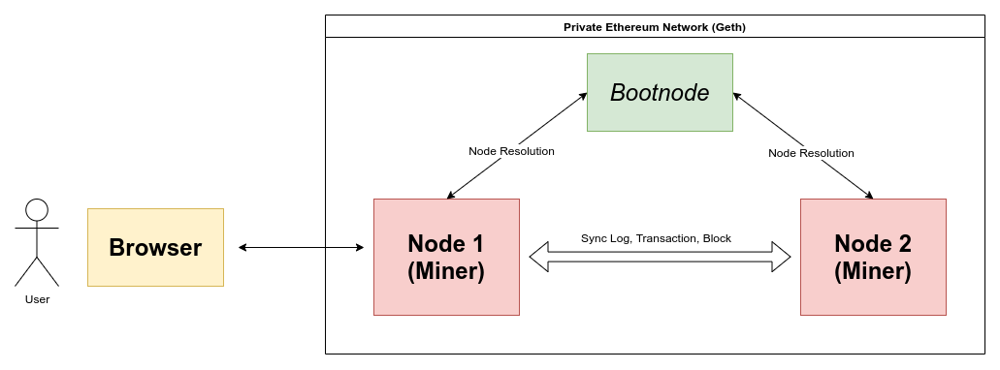

# dVote Blockchain Server Side

## Architecture of Our Private Ethereum Blockchain



Make sure to install ethereum first

```bash
sudo add-apt-repository -y ppa:ethereum/ethereum
sudo apt-get update
sudo apt-get install ethereum
```

Create several accounts first (to allocate several ether)

```bash
geth account new --datadir data
```

Lauch Bootnodes, but first create bootkey
```bash
bootnode -genkey bootnode.key
```

Then, launch the bootnode
```bash
bootnode -nodekey bootnode.key --nat extip:x.x.x.x -verbosity 7
# if you want it to run on background
nohup bootnode -nodekey bootnode.key --nat extip:x.x.x.x -verbosity 7 > bootnode-log.out 2>&1 &
```
> Save the bootnode address (starts with `enode://`)

Edit genesis.json to your need (ex. add the previously created account to the genesis file). After that, Initialize the genesis block with command,

```bash
geth init --datadir data genesis.json
```

Create `password.txt` file to store every password of your account (needed to unlock the accounts). After that Run the geth node and enable mining.

```bash
geth --datadir /home/ubuntu/geth/data/ --networkid 111 --port 30306 --nodiscover --http --http.api "personal,eth,net,web3,debug,admin,txpool,miner" --http.corsdomain="*" --http.addr="0.0.0.0" --http.port 8545 --nat extip:1x.y.z --allow-insecure-unlock --password /home/ubuntu/geth/password.txt -unlock "0xYOUR-FIRST-ACC,0xYOUR-SECOND-ACC" --bootnodes "enode://your-bootnode-address" --mine --miner.threads 1 --miner.etherbase 0xYOUR-MINING-DEST-ACC
```

Or if you want to run in the background

```bash
nohup geth --datadir /home/ubuntu/geth/data/ --networkid 2018 --http --http.api "personal,eth,net,web3,debug,admin,txpool,miner" --http.corsdomain="*" --http.addr="0.0.0.0" --http.port 8545 --nat extip:1x.y.z --allow-insecure-unlock --password /home/ubuntu/geth/password.txt -unlock "0xYOUR-FIRST-ACC,0xYOUR-SECOND-ACC" --bootnodes "enode://your-bootnode-address" --mine --miner.threads 1 --miner.etherbase 0xYOUR-MINING-DEST-ACC > geth-testnet.out 2>&1 &
```
> Repeat the steps for other geth nodes (if any)

If you want to access the console run this command

```bash
geth attach --datadir /home/ubuntu/geth/data/geth.ipc
```

If you want to get private part of the account, install web3 and extract the private key.

```bash
# Install web3
curl -LSs https://raw.githubusercontent.com/gochain/web3/master/install.sh | sh
# Extract private part
web3 account extract --keyfile ~/geth/data/keystore/UTC--20xx-xx-xxTxx-xx-xx.zzzzzzzzZ--youraccount --password your-password
```

